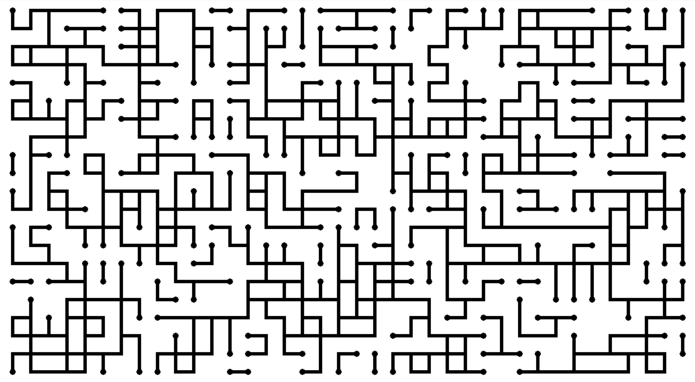

# Wave Function Collapse Algorithm

A Java implementation of the generative, visual algorithm producing pattern-based images such as this.



## Fundamentals

The name of the algorithm and parts of the language used to describe it stem from quantum physics.

Wave Function Collapse is a generative algorithm. Its building blocks are a collection of images or **Tile**
that share similar **Edge Types** where different tiles can be put against each other to create a smooth picture. 
Starting with one (or more) visible tiles, one tile gets displayed, or **collapsed**, at a time.
For choosing the next tile to be collapsed, the tile with the least options for tiles to fit the spot is chosen.
The number of options for one spot is referred to as the spot's **entropy**.

## Getting started

The application can be run from the ```WaveFunctionCollapseApp``` class where also all relevant options can be set.
The algorithm which performs the algorithms takes a so-called **Tile Set** as well as an **Algorithm Parameters**
object as arguments.

### Tile Set

The tile set is the collection of images with which the algorithm runs.
There are three classes available that extend Tile Set:
- ```LabyrinthTileSet```
- ```WavyTiles```
- ```CarcassoneTileSet```

Read more about creating new tile sets on your own under *Extensibility*.

### Parameters

The following parameters can be modified.
- **Dimension** (```Dimension```). The size of the GUI window.
- **Tile size** (```int```). The size of one tile in the GUI in pixels.
- **Algorithm speed** (```int```). The delay in milliseconds between two collapses.
- **Start configuration** (```StartConfiguration```). The first tile(s) to collapse at the beginning. Enumeration that currently supports the values *RANDOM*, *MIDDLE*, and *MULTISTART_RANDOM*.
- **Non-random factor** (```float```). A float number representing how random the collapses are. When set to zero, no randomness is included which makes the algorithm look a little boring. When set to 1, tiles are collapsed randomly across the board.
- **Edge type** (```EdgeType```). Optional. The edge type at the very edge of the GUI. If specified, the tiles bordering the edge of the GUI will have the given edge type (like in the picture above). When not specified, all edge types are valid for border tiles. 
- **Probability distribution** (```Map<TileType, Float>```). A Map mapping each TileType to a Float value representing its relative frequency to the other tiles. TileSet implements the method ```defaultProbabilityDistribution()``` which returns a map with similar probabilities for each tile. Some child classes of Tile Set provide other methods returning different probability distributions.


## Implementation 

The GUI is built with ```javax.swing```. A ```JFrame``` acts as a grid with one ```JLabel``` for each grid cell respectively.
These classes are extended in the ```gui``` package.

The ```tilesets``` package holds the default tile sets which can be extended. (see *Extensibility*).

All functionality of the algorithm itself lays in the package ```algorithm``` with ```WaveFunctionCollapseAlgorithm``` containing most of the actual logic.  

## Extensibility

New tile sets can be easily added by with the following steps.
1. Put your tile images in a new directory under ```src/main/resources``` .
2. Create a new class in the ```tilsets``` package that extends the ```TileSet``` class.
3. Override the default constructor. It should be sufficient to call the parent constructor with the directory name from step 1 passed as a string argument such as ```super("myDirectory")```.
4. Override the method ```defineTiles()``` which specifies details on the tile images.
    - Create an ```EdgeType``` object for each edge of your tile set.
    - Create all ```TileType``` objects. Each takes the name of the image file (located in the directory specified in step 1, 3), the edge types of the tile as ```List<EdgeType>```, and optionally the possible rotations of the tile as an int array ```int[]```.
    - The edge types array must contain four elements, describing the top, right, bottom, and left edge in this order.
    - When specified, the rotations array describes in which directions the image can be rotated. The possible values 1, 2, 3 mean as many 90-degree clockwise rotations.
    - When not specified, the rotations array will be computed by comparing the edges in the default and each rotated state. When all edges align (e.g. a tile with only one edge type on all four edges), the rotation is considered unnecessary and will not be included.
    - Since there are tiles which are not symmetric, even if the edges do not change on rotation, rotations can be provided manually.
5. (Optional) Create a new method which returns a ```Map<TileType, Float>``` that represents a different probability distribution of the tiles.
6. Instantiate an object of your tile set class in the ```WaveFunctionColapseApp``` and pass it into the constructor for ```WaveFunctionCollapseAlgorithm```. Specify the parameters objects to your needs and you're good to go.

To check for any errors with the created tile set, activate ```asserts``` as a VM argument.